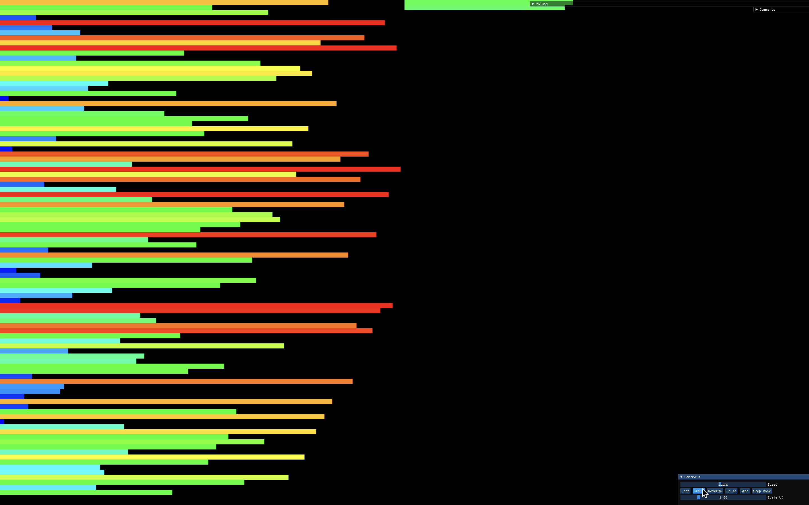
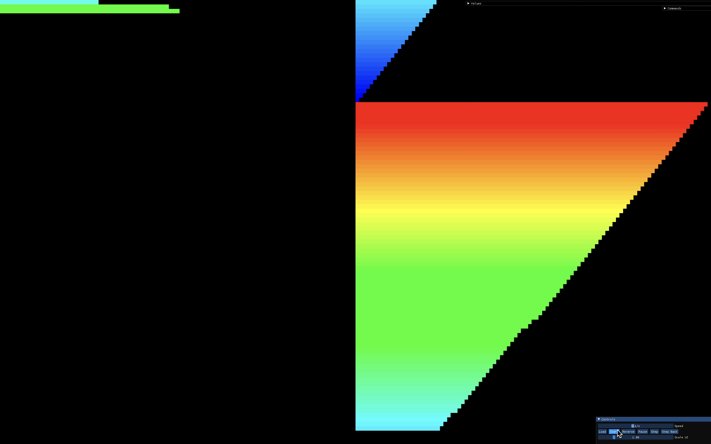
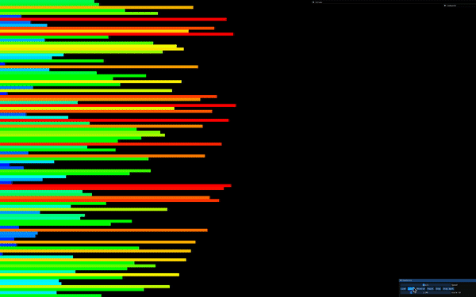

# Push_Swap

First of all, I strongly suggest you to read [my blog post](https://medium.com/@ayogun/push-swap-c1f5d2d41e97). If you are as lazy as I am and looking for 125 score, you are in right place.

</br>


</br>

# Content

1. [Challenge](#challenge)
2. [Project](#the-project)
3. [Pseudo Code](#psuedo-code)
4. [Flow Chart](#flowchart)
5. [Visualizer](#visualizer)
6. [Checker](#checker)
7. [Resources](#resources)

</br></br>

## Challenge

Sort a random list of integers using the smallest number of moves, 2 stacks
and a limited set of operations. <br />
<br />

You start with two empty stacks: **a** and **b**. You are given a random list of integers via command line arguments.
<br />
<br />

Only these moves are allowed:
- `sa` : swap a - swap the first 2 elements at the top of stack a. Do nothing if there is only one or no elements).
- `sb` : swap b - swap the first 2 elements at the top of stack b. Do nothing if there is only one or no elements).
- `ss` : `sa` and `sb` at the same time.
- `pa` : push a - take the first element at the top of b and put it at the top of a. Do
nothing if b is empty.
- `pb` : push b - take the first element at the top of a and put it at the top of b. Do
nothing if a is empty.
- `ra` : rotate a - shift up all elements of stack a by 1. The first element becomes
the last one.
- `rb` : rotate b - shift up all elements of stack b by 1. The first element becomes the last one.
- `rr` : `ra` and `rb` at the same time.
- `rra` : reverse rotate a - shift down all elements of stack a by 1. The last element becomes the first one.
- `rrb` : reverse rotate b - shift down all elements of stack b by 1. The last element becomes the first one.
- `rrr` : `rra` and `rrb` at the same time.
<br />

At the end, **stack b** must empty empty and all integers must be in **stack a**, sorted in ascending order. <br />
<br />

## The Project
Create two programs: ```checker``` and ```push_swap```. <br />

The ```checker``` program reads a random list of integers from the stdin, stores them, and checks to see
if they are sorted. <br />
<br />
The ```push_swap``` program calculates the moves to sort the integers – *pushing, popping, swapping* and *rotating* 
them between **stack a** and **stack b** – and displays those directions on the stdout. <br />
<br />
You can pipe ```push_swap``` into ```checker```, and ```checker``` will verify that ```push_swap```'s instructions were successful. 
<br />

Both programs must mandatorily parse input for errors, including empty strings, no parameters, 
non-numeric parameters, duplicates, and invalid/non-existent instructions.

**Push_Swap** must conform to the [42 Norm](https://cdn.intra.42.fr/pdf/pdf/960/norme.en.pdf). <br />
Using normal ```libc``` functions is strictly forbidden. Students are however, allowed to use: ```write```, ```read```, ```malloc```, ```free```, ```exit```. 
It must not have any memory leaks. Errors must be handled carefully. <br />
In no way can it quit in an unexpected manner (segmentation fault, bus error, double free, etc).

</br></br>

## Psuedo Code

</br>

1. In order to start sorting, my code pushes first two elements from top of the stack_a to the stack_b. By this way, we are creating one smallest number and one biggest number in stack_b. This is the prerequisites of my code. Because before pushing a number from stack_a to stack_b, one of the major thing the algorithm does is; comparing the number being pushed with the smallest number of stack_b and the biggest number of stack_b.



2. At this step, algorithm checks every number in stack_a. It searches the number which requires the minimum amount of operations in order to be placed at stack_b in correct spot.

3. After that, algorithm decides which number should be pushed, it calculates how many times it should rotate stack_a and how many times it should rotate the stack_b. Whicehever has the smallest number, algorithm rotates both of the stacks as the smallest number indicates. And it completes the rest of the rotates in the one single stack which ever stack required more rotate operation. You can watch how this step works in action [here](#visualizer).

4. After this, algorithm pushed the number from the top of the stack_a to top of the stack_b. Every time this spot at stack_b is correct spot for the number thanks to the previous calculations.This pushing loop continues until only three elements are left in stack_a. 

5. Algorithm quickly sorts the left three members in the stack_a.



6. Every members in stack_b one by one are being pushed to the stack_a from top to the bottom. However, it checks everytime before the elements are being pushed. This continues until the stack_b is emptied.


7. Finally, last time required amount of rotation is being applied in order to bring the smallest number on to the top of the stack_a.


</br>

### Flowchart

You can take a closer look at it.


Don't forget to open the image in new_tab in order to make zoom in.

</br>

## Visualizer



</br>

## Checker

For furhter detail about checker program, [click here](./srcs/checker/README.md).

</br>

## Resources

I wrote an article about how the algorithm works. I strongly recommend you to read the article to grasp the idea:

<a href="https://medium.com/@ayogun/push-swap-c1f5d2d41e97">Push Swap — A journey to find most efficient sorting algorithm </a>
